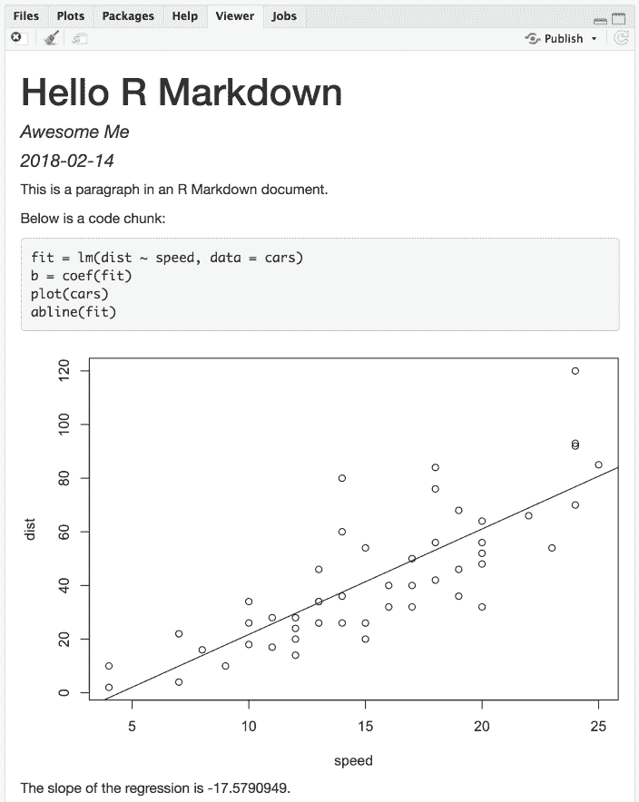

  
```{r setup, include=FALSE}


options(htmltools.dir.version = FALSE)
knitr::opts_chunk$set(fig.dim=c(4.8, 4.5), fig.retina=2, out.width="100%")
knitr::opts_hooks$set(fig.callout = function(options) {
  if (options$fig.callout) {
    options$echo <- FALSE
    options$out.height <- "99%"
    options$fig.width <- 16
    options$fig.height <- 8
  }
  options
})


library(tidyverse)
library(xaringan)
library(rmarkdown)
menu <- read.csv("menu.csv")
```

```{css, echo=FALSE}
/* custom.css */
.left-code {
  color: #777;
  width: 38%;
  height: 92%;
  float: left;
}
.right-plot {
  width: 60%;
  float: right;
  padding-left: 1%;
}
.plot-callout {
  height: 225px;
  width: 450px;
  bottom: 5%;
  right: 5%;
  position: absolute;
  padding: 0px;
  z-index: 100;
}
.plot-callout img {
  width: 100%;
  border: 4px solid #23373B;
}
```


```{r, message=FALSE, warning=FALSE, echo=FALSE}
library(tidyverse)
library(datasets)
library(knitr)
library(kableExtra)
library(broom)

source(file = "xaringan_reveal_parenthethical.R")


```

.center[
# WHAT IS R?
]

.left[
  
  **R** is a programming language and **free** software environment for statistical computing and graphics supported by the R Foundation for Statistical Computing.
  
  R is based on programming language S created in 1976 by John Chambers.
  
  First R version was released in 1995 by Ross Ihaka and Robert Gentleman at the University of Auckland, New Zealand.
  
  First stable beta version of **R** was released in 2000.
]
--
.left[
```{r, echo=FALSE, out.width= 350, out.height= 250}
    
    
```
  
  ]

---
.center[
#R vs R Studio
]

  .pull-left[
**R** is the programming language,
You install it and is pretty much a console (terminal).

Not very user friendly

```{r,echo=FALSE, out.width= 350, out.height= 275}

```
]

--

.pull-right[
**R Studio** is a free and open-source integrated development environment (IDE) for R.

Nicer, more user friendly. (not just that)
```{r,echo=FALSE, out.width= 350, out.height= 275}
knitr::include_graphics("Images/RStudio_window.png")
```

]

---

.center[
# RStudio interface is like cooking


```{r,echo=FALSE, out.width= 700, out.height= 450}
knitr::include_graphics("Images/RStudio.jpg")
```

]

.footnote[
<font size="2"> Image From RLadies NewCastle group</font>
]
---

.center[
##Installing R
]

Installing R: https://www.r-project.org

Installing R Studio: https://www.rstudio.com

--

Both softwares have a Windows, Linux and Mac OS version and from my experience they work pretty well on all of the three systems.

Great Tool, does not need installation at the moment fully free is:

https://www.r-studio.cloud

(still in beta). You can open R studio from browser anywhere create projects, install packages and read data just as you would do offline on an installed version.


---

.center[ #R Packages

```{r,echo=FALSE, out.width= 700, out.height= 450}
knitr::include_graphics("Images/R_packages.jpg")
```


]

---

.center[#Loads of packages, great but..


<iframe src="https://giphy.com/embed/3o6Mbsras7qdAwgABW" width="480" height="364" frameBorder="0" class="giphy-embed" allowFullScreen></iframe><p><a href="https://giphy.com/gifs/season-3-the-simpsons-3x5-3o6Mbsras7qdAwgABW"></a></p>

Having so much choice can be confusing but we'll work on it
]

---
.center[
#What do I do when I first open R?
**CREATE AN R PROJECT**

]


```{r,echo=FALSE, out.width= 700, out.height= 450}

```

---

.center[#Why not just typing code and save scripts?

]

 - Keeps all the files and scripts in a centralised working directory
 
 - Less likely to need to type paths to read data or save images (everything is kept there in the project directory!)
 
 - *Beautifully* forces you to be organised!
 
 - It ties your history and global environment (active variables) to the project.
If you need to work on something else you can just switch project!!!

 - It allows pushing to GIT/version control


.center[
<iframe src="https://giphy.com/embed/l2JInZhQ501ASOEs8" width="275" height="175" frameBorder="0" class="giphy-embed" allowFullScreen></iframe><p><a href="https://giphy.com/gifs/warnerarchive-a-mighty-wind-l2JInZhQ501ASOEs8"></a></p>
]
---

.center[
#A great ensemble of packages: The tidyverse


```{r,echo=FALSE, out.width= 500, out.height= 250}

```
]


.left[
The **tidyverse** is a coherent system of packages for data manipulation, exploration and visualisation that shares a common design philosophy.
]

---
.center[
#The Tidyverse: Advantages

```{r,echo=FALSE,fig.cap= "https://www.tidyverse.org", out.width= 600, out.height= 375}
knitr::include_graphics("Images/tidy_workflow.png")
```

]

.left[
Each of these packages has consistent functions, coherent syntax and proposes uniform standard procedures and coding style for data science.
]

---

.center[
#Install and load the Tidyverse
##(and any other package)
]

```{r, eval = FALSE}
install.packages("tidyverse") # Install 

library(tidyverse) # Load

```


This is quite handy as we are installing/loading all the components of the tidyverse in two commands!

---
.center[
#Read some data (Finally!)
]
.top[
```{r, read_data, echo = TRUE, message = FALSE}

data <- read_csv("randomdata.csv")

```
]

.bottom[
```{r,echo = TRUE}
data
```

]

---
.center[
#Things to notice
]

.left[
```{r,eval = FALSE}
read_csv("randomdata.csv")
```
- For consistency here I used the function read_csv function. This is part of the *readr* package loaded and installed with the **tidyverse**.

- You can add arguments to this function, for instance `col_names = FALSE` in case your data do not have header columns.

- You can use the function `read_delim()` to read a .txt file.

- **NB** Among the quotes if your data are not in the working directory there would be the whole path where the file is. This is the advantage of having a **project directory!**

- Compared to **R Base** commands ` read.csv` or `read.table` it will read your data `as.tibble()` a modern version of dataframes highly compatible with the tidyverse. Follow this [link](https://cran.r-project.org/web/packages/tibble/vignettes/tibble.html) for details.

]

---
.center[
# Our data should be _tidy_
]

For operations with all the tidyverse packages (including ggplot2) our data should be in a tidy format. **Tidy data sets are arranged such that each variable is a column and each observation (or trial) is a row.**


.center[
```{r,echo=FALSE, out.width= 500, out.height= 300}

```
]

Because often this is often the way data come out from our experiments and lack of time we will start with an already tidy dataset. For tidying your data you can use either `gather()` and `spread()` from _tidyr_ or `melt()` and `cast()` from package `reshape2`.
---
.center[
#Wrangling data with _Dplyr_


```{r, echo = FALSE,out.width= 400, out.height= 450}
knitr::include_graphics("Images/dplyr.png")
```
]

---
.center[
#Processing data with `dplyr`
]
Dplyr has mainly the following 7 crucial functions for data wrangling:

1. `select()` **Keeps** only the __variables__ we specify **(filters by columns)**

1. `filter()` __Keeps__ only the __observations__ we specify **(filters the rows)**

1. `rename()` **Renames** the variables names but keeps everything

1. `group_by()` **Groups** data by variable in order to summarise

1. `summarise()` **Computes** variables on a grouped dataset (e.g. average)

1. `mutate()` **Computes** new variables based on those we have.

1. `arrange()` **Sorts** data in the order you indicate.

---

.center[
#Get your data ready for the analyses 
]

Let's go back to our _datafile_. These are randomly generated data from an imaginary TMS experiment where we stimulate a face selective area (_ffa_, stimulator does not even reach it)
and an object selective area (_lo_). they were stimulated in two different experiments (_face_ vs _object_) and in two different conditions (cong vs incong). **Mixed ANOVA design**

Let's have a look..
.center[
```{r, data, echo = FALSE}
head(data)
```
]
.center[
### Let's wrangle them for analyses and plots!
]

---

.pull-left[
```{r mycode, echo = FALSE, eval = TRUE, fig.height = 5, highlight = TRUE}
data %>% 
  select(-X) %>% 
  rename(Experiment = Task) %>% 
  filter(!SubjID %in% c("P19","P01","p58","p63")) %>% 
  group_by(SubjID, Experiment, Site, Congruency) %>%  
  summarise(meanRT = mean(RT[Acc==1]), meanAcc = mean(Acc)) %>%
  mutate(Efficiency = meanRT/meanAcc) -> 
  AveMat 
```
]


---

`r apply_reveal("mycode")`

```{css, eval = TRUE, echo = F}
.remark-code{line-height: 1.5; font-size: 80%}
```

.center[
We successfully:
]
- Removed one column we did not want to use with `select`
- Renamed a variable with `rename`
- Excluded outliers with `filter`(click [here](https://sites.google.com/view/marcogandolfo/resources) to find a function to identify outliers)
- Averaged trials by participant by condition with `group_by` and `summarise`
- Computed a new variable with `mutate`
- Saved it all in a new data.frame called AveMat


---
.center[
#ggPlot2

```{r, ggplot2, echo = FALSE, fig.cap= "https://www.tidyverse.org", out.width=400, out.height= 450}

```
]

---
.center[
#The skeleton of any ggplot
] 

- **Tidy data**

- __geom__etric objects are the shape or visual representation of our data. ("the how")

- __aes__thetics map the data to geom (_the what_)

```{r, ggplot3, echo = FALSE, fig.cap= "Sources: https://rfortherestofus.com/ and https://www.williamrchase.com ", fig.width= 500, fig.height= 180}

```


---

.center[
#Scatterplot
]


.left-code[
```{r ciao, eval = FALSE, fig.show = "hide"}
ggplot(menu, 
       aes(Fat, 
           Calories)) + 
  geom_point() 
  
```


]

.right-plot[
```{r plot-label-out, ref.label="ciao", echo=FALSE, fig.dim=c(4.8, 4.5), out.width="100%"}

```
]


---
.center[
#Scatterplot
]


.left-code[
```{r graf, eval = FALSE, fig.show = "hide"}
menu %>% 
filter(Category %in% c("Breakfast",
                       "Chicken & Fish")) %>%   
ggplot(aes(Fat, 
           Calories, 
           color = Category, 
           fill = Category)) + 
  geom_point() +
  geom_smooth(method = "lm") +
  theme_classic(base_size = 10) +
  labs(x = "Fat(g)", 
       y = "Calories (kcal)") +
  coord_cartesian(ylim = c(0,1000), 
                  xlim = c(0,50))
  
```


]

.right-plot[
```{r plot-label-now, ref.label="graf", echo=FALSE, fig.dim=c(4.8, 4.5), out.width="100%"}

```
]

---
.center[
#A barplot
]

.left-code[
```{r graf2, eval = FALSE, fig.show = "hide"}

ggplot(AveMat) +
aes(Site, 
    Efficiency, 
    fill = Congruency) +
stat_summary(geom = "bar", 
             fun.y = mean, 
             position = "dodge", 
             color = "black") + 
stat_summary(geom = "errorbar", 
             fun.data = mean_se, 
             position = position_dodge(.9),
             width = 0.2, 
             color = "black")

```
]

.right-plot[
```{r graf2-label-now, ref.label="graf2", echo=FALSE, fig.dim=c(4.8, 4.5), out.width="100%"}
```
]

---
.center[
#A barplot
]

.left-code[
```{r graf3, eval = FALSE, fig.show = "hide"}

ggplot(AveMat) +
aes(Site, 
    Efficiency, 
    fill = Congruency) +
stat_summary(geom = "bar", 
             fun.y = mean, 
             position = "dodge", 
             color = "black") + 
stat_summary(geom = "errorbar", 
             fun.data = mean_se, 
             position = position_dodge(.9),
             width = 0.2, 
             color = "black") +
labs(y = "Efficiency ms/Acc", 
     x= "Stimulation site") +
facet_wrap(~Experiment) +
theme_classic(base_size = 10) +
scale_fill_grey() +
coord_cartesian(ylim = c(1250,2000))

```
]

.right-plot[
```{r graf3-label-now, ref.label="graf3", echo=FALSE, fig.dim=c(4.8, 4.5), out.width="100%"}
```
]


---
.center[
#A violin plot
]


.left-code[
```{r graf4, eval = FALSE, fig.show = "hide", fig.retina = 2}

ggplot(AveMat) +
aes(Site, 
    Efficiency, 
    fill = Congruency) +
geom_violin(alpha = 0.2) +
facet_wrap(~Experiment)

```
]

.right-plot[
```{r graf4-label-now, ref.label="graf4", echo=FALSE, fig.dim=c(4.8, 4.5), out.width="100%"}
```
]


---

.center[
#A  prettier violin plot with a boxplot
]


.left-code[
```{r graf5, eval = FALSE, fig.show = "hide", fig.retina = 2}

ggplot(AveMat) +
aes(Site, 
    Efficiency, 
    fill = Congruency) +
geom_violin(alpha = 0.2) +
geom_boxplot(aes(middle= mean(Efficiency)), 
                 width = 0.20, 
                 position = position_dodge(0.9), 
                 outlier.shape = NA, 
                 alpha = 0.6) + 
labs(y = "Efficiency ms/Acc", 
     x= "Stimulation site") + 
facet_wrap(~Experiment) +
theme_classic(base_size = 10) +
scale_fill_brewer(palette = "Dark2") +
theme(strip.background = element_blank()) 

        
```
]

.right-plot[
```{r graf5-label-now, ref.label="graf5", echo=FALSE, fig.dim=c(4.8, 4.5), out.width="100%"}
```
]


---

.center[
# A violinplot with individual data points
]

.left-code[
```{r graf6, eval = FALSE, fig.show = "hide", fig.retina = 2}

ggplot(AveMat) +
aes(Site, Efficiency, fill = Congruency) +
geom_violin(alpha = 0.2) +
labs(y = "Efficiency ms/Acc", x= "Stimulation site") + 
facet_wrap(~Experiment) +
theme_classic(base_size = 10) +
scale_fill_brewer(palette = "Dark2") +
theme(strip.background = element_blank()) +
geom_point(shape = 21,size=1, 
           position = position_jitterdodge(0.2), 
           color="black",
           alpha=0.5)
        
```
]

.right-plot[
```{r graf6-label-now, ref.label="graf6", echo=FALSE, fig.dim=c(4.8, 4.5), out.width="100%"}
```
]


---
.center[
#Report your data with RMarkdown


```{r, ggplot4, echo = FALSE, fig.cap= "", out.width=400, out.height= 450}
knitr::include_graphics("Images/hex-rmarkdown.png")
```
]

---
.center[
#R Markdown
]
The document format "R Markdown" was first introduced in the knitr package (Xie, 2015, 2019) in early 2012. It allows to embed code chunks of several programming languages in Markdown documents. Through another package called (_Pandoc_)[http://pandoc.org] it is possible to convert Markdown documents to a large variety of formats (pdf, HTML, Word etc.)

I strongly advice to use it if you are working in group.
It allows to build simply and effectively data reports to share with your lab members but has much more potential:

- Make slides for presentations (like these ones :) )
- Write journal articles and books.
- Make websites and blogs [(Here example of a tutorial)](https://marco2gandolfo.github.io/rforpsychologists/My_First_R_Stuff_Tutorial.html)


---
.center[
#Markdown Sintax vs Knitted file
]

  .pull-left[
How an not-rendered markdown file looks like

```{r,echo=FALSE, out.width= 350, out.height= 275}
knitr::include_graphics("Images/hello-rmd.png")
```
]

--

.pull-right[
How a rendered rmarkdown file looks like in its simplest form.
```{r,echo=FALSE, out.width= 350, out.height= 325}

```
]


.footnote[
######Pictures from https://bookdown.org/yihui/rmarkdown/r-code.html
]


---
.center[
#Basic syntax
]

.pull-left[
`###Code`
- `#Header 1`
- `##Header 2`
- `###Header 3`
- `*italic*`
- `**bold**`
- `[A link to wikipedia](www.wikipedia.com)`
- `> *A very felt blocked quote at the begin of your paper*`
]

.pull-right[
###Render
- #Header 1
- ##Header 2
- ###Header 3
- *Italic*
- **bold**
- [A link to wikipedia](www.wikipedia.com)
- > *A very felt blocked quote at the begin of your paper*
]

---

.center[
#Basic syntax
]

.pull-left[
`###Code`
- `- list without numbers`
- `- list without numbers`
- `1 list with numbers`
- `1 list with numbers`

***

``
]

.pull-right[
###Render
- list without numbers
- list without numbers
1. list with numbers
1. list with numbers

***

```{r, echo = FALSE,out.width = 50, out.height = 50}

```


]


---
.center[
#Make a Table and compute descriptives with Tidyverse
]


```{r, echo = TRUE, eval = TRUE}
AveMat %>% 
group_by(Site, 
         Experiment,
         Congruency) %>% 
summarise(mEff = mean(Efficiency), 
          sdEff = sd(Efficiency), 
          seEff = sdEff/sqrt(42)) -> DescMat 


knitr::kable(DescMat)


```


---
#Why I didn't do any analyses?

- Wrangling data and manipulate matrices is the pre-requisite of running any analysis.

- Superior data wrangling and visualisation capabilities of R might motivate more to step away from manipulating data with spreadsheets.

- Many use different statistical analyses but Everyone has to hit their head on wrangling and visualise data.

.center[
<iframe src="https://giphy.com/embed/3otPoCmoVM8gvKbAEo" width="480" height="204" frameBorder="0" class="giphy-embed" allowFullScreen></iframe><p><a href="https://giphy.com/gifs/quentin-tarantino-pulp-fiction-harvey-keitel-3otPoCmoVM8gvKbAEo"></a></p>
]

---

.center[
#Resources
]

- https://www.rstudio.com/resources/cheatsheets/ quick guides to remind packages main functions

- https://r4ds.had.co.nz/ R for data science book

- https://evamaerey.github.io/tidyverse_in_action/tidyverse_in_action.html#1 great presentation that helped making this one

- https://marco2gandolfo.github.io/rforpsychologists/My_First_R_Stuff_Tutorial.html

- https://rfortherestofus.com/

- https://www.williamrchase.com/slides/ggplot_intro.html#1 Another great presentation for dataviz in ggplot very inspiring.

- http://joeystanley.com/ A great site full of resources

- https://psyteachr.github.io/ Impressive collection of Materials from Glasgow Uni

There is much more. The community is making R really approachable and we should all remember that it is *Free*!
---

class: center

#Thanks for your attention


```{r, echo = FALSE}

```

